# PRM Tool — Class Diagram

The following class diagram outlines a recommended backend architecture for the PRM Tool. It follows a standard **Controller-Service-Repository** layering structure and demonstrates applying design patterns (e.g., the **Strategy Pattern** for the LLM providers and the **Repository Pattern** for database access) as requested in the technical requirements of the BRD.

```mermaid
classDiagram

    %% ----------------------------------------------------
    %% Models / Entities
    %% ----------------------------------------------------
    namespace Models {
        class User {
            +int id
            +String username
            +String passwordHash
            +Role role
            +boolean forcePasswordChange
            +boolean isActive
        }
        
        class Employee {
            +int id
            +int userId
            +String name
            +Status status
            +int totalUtilisation
            +boolean isActive
        }
        
        class Project {
            +int id
            +String name
            +Status status
            +HealthStatus healthStatus
            +int managerId
        }
        
        class Allocation {
            +int id
            +int employeeId
            +int projectId
            +int utilisationPercent
            +Date fromDate
            +Date toDate
        }
        
        class Timesheet {
            +int id
            +int employeeId
            +Date weekStartDate
            +Status status
        }
    }
    
    User "1" *-- "0..1" Employee : linked profile
    Project "1" *-- "*" Allocation : has
    Employee "1" *-- "*" Allocation : assigned
    Employee "1" *-- "*" Timesheet : submits

    %% ----------------------------------------------------
    %% Controllers (API Entry Points)
    %% ----------------------------------------------------
    namespace Controllers {
        class AuthController {
            +login(Credentials) Response
            +changePassword(PwdDto) Response
        }
        class AdminController {
            +createUser(UserDto) Response
            +addEmployee(EmployeeDto) Response
            +deactivateEmployee(id) Response
            +updateSystemConfig(ConfigDto) Response
        }
        class ManagerController {
            +getResourceDashboard() Response
            +aiSkillMatch(MatchRequest) Response
            +allocateResource(AllocDto) Response
            +getMyProjects() Response
            +aiRiskSummary(projectId) Response
        }
        class EmployeeController {
            +submitTimesheet(TimesheetDto) Response
            +getMyTimesheets() Response
        }
    }

    %% ----------------------------------------------------
    %% Services (Business Logic)
    %% ----------------------------------------------------
    namespace Services {
        class AuthService {
            +authenticate(username, pwd) Token
            +updatePassword(userId, newPwd)
        }
        
        class AdminService {
            +registerUser(UserDto) User
            +registerEmployeeProfile(EmployeeDto) Employee
            +deactivateProfile(empId)
        }
        
        class AllocationService {
            +validateAllocation(empId, dates, percent) boolean
            +assignResource(AllocDto) Allocation
            +endAssignment(allocId)
            +computeEmployeeUtilisation(empId) int
        }
        
        class TimesheetService {
            +processSubmission(TimesheetDto)
            +getTeamHistory(managerId, week) List
        }
        
        class SchedulerService {
            +runPeriodicChecks()
            -recomputeUtilisation()
            -flagOverdueMilestones()
            -computeProjectHealth()
        }
        
        %% Strategy Pattern for LLMs
        class IAIService {
            <<interface>>
            +generateSkillMatch(requirement, candidates) List
            +generateRiskSummary(projectFacts) String
        }
        class GeminiAIService {
            +generateSkillMatch()
            +generateRiskSummary()
        }
        class GroqAIService {
            +generateSkillMatch()
            +generateRiskSummary()
        }
    }

    IAIService <|.. GeminiAIService : implements
    IAIService <|.. GroqAIService : implements

    ManagerController --> IAIService : delegates to
    ManagerController --> AllocationService
    AdminController --> AdminService
    AuthController --> AuthService
    EmployeeController --> TimesheetService

    %% ----------------------------------------------------
    %% Repositories (Data Access)
    %% ----------------------------------------------------
    namespace Repositories {
        class IRepository~T~ {
            <<interface>>
            +findById(id) T
            +save(T) T
            +delete(id)
            +findAll() List~T~
        }
        class UserRepository {
            +findByUsername(username) User
        }
        class EmployeeRepository {
            +findBenchEmployees() List
        }
        class AllocationRepository {
            +findActiveByProject(projectId) List
        }
        class ProjectRepository
    }

    IRepository <|.. UserRepository
    IRepository <|.. EmployeeRepository
    IRepository <|.. AllocationRepository
    IRepository <|.. ProjectRepository

    AdminService --> UserRepository
    AdminService --> EmployeeRepository
    AllocationService --> AllocationRepository
    SchedulerService --> AllocationRepository
    SchedulerService --> ProjectRepository

```

### Design Patterns Highlighted:
1. **Strategy Pattern:** The `IAIService` interface allows the system to switch between `GeminiAIService` and `GroqAIService` based on the Admin's system configuration, fulfilling the BRD requirement to support dynamic LLM provider swapping without modifying core logic.
2. **Repository Pattern:** The `IRepository<T>` interface and its concrete implementations decouple the database access from the business logic inside the Services.
3. **Separation of Concerns (SOLID):** The API layer (Controllers), Business Logic layer (Services), and Data Access layer (Repositories) are strictly separated.
