# PRM Tool — Class Diagram

The following class diagram outlines the backend architecture for the PRM Tool. It follows a standard **Controller-Service-Repository** layering structure and demonstrates applying design patterns (e.g., the **Strategy Pattern** for the LLM provider and the **Repository Pattern** for database access) as requested in the technical requirements of the BRD.

```mermaid
classDiagram

    %% ----------------------------------------------------
    %% Models / Entities
    %% ----------------------------------------------------
    namespace Models {
        class User {
            +int id
            +int roleId
            +Role role
            +int managerId
            +String username
            +String email
            +String fullName
            +String passwordHash
            +String department
            +String designation
            +boolean forcePasswordChange
            +boolean isActive
        }

        class Resource {
            +int id
            +int userId
            +int managerId
            +ResourceStatus status
            +int totalUtilisation
            +boolean timesheetAccessFrozen
            +Date timesheetFrozenWeekStart
        }

        class Role {
            +int id
            +String name
        }

        class Skill {
            +int id
            +String skillName
            +SkillCategory category
        }

        class ResourceSkill {
            +int id
            +int resourceId
            +int skillId
            +Proficiency proficiencyLevel
        }

        class Project {
            +int id
            +String name
            +String description
            +Date startDate
            +Date endDate
            +int totalStoryPoints
            +ProjectStatus status
            +HealthStatus healthStatus
            +int managerId
            +Date atRiskNotifiedAt
        }

        class Milestone {
            +int id
            +int projectId
            +String title
            +Date dueDate
            +int storyPoints
            +MilestoneStatus status
            +HealthFlag healthFlag
        }

        class Allocation {
            +int id
            +int resourceId
            +int projectId
            +int utilisationPercent
            +Date fromDate
            +Date toDate
        }

        class Timesheet {
            +int id
            +int resourceId
            +Date weekStartDate
            +String status
            +int reminderCount
            +Date lastReminderSentAt
        }

        class TimesheetEntry {
            +int id
            +int timesheetId
            +int projectId
            +int hours
        }

        class ActivityTag {
            +int id
            +int timesheetEntryId
            +String tagName
        }

        class SystemConfig {
            +int id
            +LlmProvider llmProvider
            +String llmHost
            +String llmModel
            +String llmApiKey
            +int schedulerIntervalHrs
            +int maxWeeklyHours
        }
    }

    Role "1" *-- "*" User : assigned to
    User "1" *-- "0..1" Resource : has profile
    User "1" *-- "*" User : manages team
    User "1" *-- "*" Project : manages
    Resource "1" *-- "*" ResourceSkill : possesses
    Skill "1" *-- "*" ResourceSkill : catalogued in
    Project "1" *-- "*" Allocation : has
    Project "1" *-- "*" Milestone : contains
    Resource "1" *-- "*" Allocation : assigned
    Resource "1" *-- "*" Timesheet : submits
    Timesheet "1" *-- "*" TimesheetEntry : contains
    TimesheetEntry "1" *-- "*" ActivityTag : described by
    TimesheetEntry "*" --> "1" Project : logged against

    %% ----------------------------------------------------
    %% Controllers (API Entry Points)
    %% ----------------------------------------------------
    namespace Controllers {
        class AuthController {
            +login(LoginDto) Response
            +changePassword(ChangePasswordDto) Response
        }
        class AdminController {
            +createUser(UserDto) Response
            +getAllUsers() Response
            +resetPassword(id) Response
            +deactivateUser(id) Response
            +reactivateUser(id) Response
            +getAllEmployees() Response
            +updateEmployee(id) Response
            +deactivateEmployee(id) Response
            +assignManager(AssignManagerDto) Response
            +manageSkills(employeeId) Response
            +createProject(ProjectDto) Response
            +manageMilestones(projectId) Response
            +getAllAllocations() Response
            +updateSystemConfig(ConfigDto) Response
        }
        class ManagerController {
            +getResourceDashboard() Response
            +getEmployeeDetail(id) Response
            +allocateResource(AllocDto) Response
            +validateAllocation(AllocDto) Response
            +endAllocation(id) Response
            +getMyProjects() Response
            +getProjectDetail(id) Response
            +getTeamTimesheets() Response
            +getFrozenEmployees() Response
            +restoreTimesheetAccess(id) Response
            +aiSkillMatch(MatchRequest) Response
            +aiRiskSummary(projectId) Response
            +aiTeamBuild(requirement) Response
        }
        class EmployeeController {
            +submitTimesheet(TimesheetDto) Response
            +getMyTimesheets() Response
            +getTimesheetWeekDetail() Response
            +getSubmitContext() Response
            +checkMissedTimesheet() Response
            +getMyAllocations() Response
        }
    }

    %% ----------------------------------------------------
    %% Services (Business Logic)
    %% ----------------------------------------------------
    namespace Services {
        class AuthService {
            +authenticate(LoginDto) Token
            +changePassword(userId, newPwd, confirmPwd)
        }

        class AdminService {
            <<facade>>
            +createUser(UserDto) User
            +manageEmployees()
            +manageProjects()
            +assignManager(AssignManagerDto)
            +updateSystemConfig(ConfigDto)
        }
        class AdminUserService {
            +createUser(UserDto)
            +resetPassword(userId)
            +deactivateUser(userId)
            +reactivateUser(userId)
        }
        class AdminEmployeeService {
            +updateEmployee(id)
            +deactivateEmployee(id)
            +assignManager(AssignManagerDto)
            +manageSkills(resourceId)
        }
        class AdminProjectService {
            +createProject(ProjectDto)
            +manageMilestones(projectId)
        }

        class ManagerService {
            <<facade>>
            +getResourceDashboard(managerId)
            +allocateResource(managerId, AllocDto)
            +getMyProjects(managerId)
            +performSkillMatch()
            +performRiskSummary()
            +performTeamBuild()
        }
        class ManagerTeamService {
            +getResourceDashboard(managerId)
            +allocateResource(managerId, AllocDto)
            +getProjectDetail(managerId, projectId)
            +restoreTimesheetAccess(managerId, resourceId)
        }
        class ManagerAIService {
            +performSkillMatch()
            +performRiskSummary()
            +performTeamBuild()
        }

        class EmployeeService {
            +submitTimesheet(userId, TimesheetDto)
            +getMyTimesheets(userId)
            +getMyAllocations(userId)
            +checkMissedTimesheet(userId)
        }

        class AllocationService {
            +validateAllocation(AllocDto) Validation
            +allocateResource(AllocDto) Allocation
            +endAssignment(allocId)
            +computeResourceUtilisation(resourceId) int
        }

        class TimesheetService {
            +processSubmission(TimesheetDto)
            +getTeamHistory(managerId, week) List
        }

        class SchedulerService {
            +start()
            +runAllChecks()
            -recomputeAllResourceUtilisations()
            -flagMissedTimesheets()
            -flagOverdueMilestones()
            -computeAllProjectHealthStatuses()
        }
        class TimesheetNotificationService {
            +processNotifications()
        }
        class ProjectHealthNotificationService {
            +notifyAtRisk(projectId)
        }
        class EmailService {
            +send(to, subject, body)
        }

        class IAIService {
            <<interface>>
            +generateSkillMatch(requirement, candidates) List
            +generateRiskSummary(projectFacts) String
            +generateTeamBuild(requirement, benchCandidates) List
        }
        class GemmaAIService {
            +generateSkillMatch()
            +generateRiskSummary()
            +generateTeamBuild()
        }

        class AIServiceFactory {
            +create() IAIService
        }
    }

    AdminService --> AdminUserService
    AdminService --> AdminEmployeeService
    AdminService --> AdminProjectService
    ManagerService --> ManagerTeamService
    ManagerService --> ManagerAIService
    ManagerAIService --> IAIService : uses
    IAIService <|.. GemmaAIService : implements
    AIServiceFactory --> GemmaAIService : creates
    SchedulerService --> TimesheetNotificationService
    SchedulerService --> ProjectHealthNotificationService
    TimesheetNotificationService --> EmailService
    ProjectHealthNotificationService --> EmailService

    AdminController --> AdminService
    AuthController --> AuthService
    ManagerController --> ManagerService
    EmployeeController --> EmployeeService
    ManagerTeamService --> AllocationService
    ManagerTeamService --> TimesheetService
    EmployeeService --> TimesheetService

    %% ----------------------------------------------------
    %% Repositories (Data Access)
    %% ----------------------------------------------------
    namespace Repositories {
        class IRepository~T~ {
            <<interface>>
            +findById(id) T
            +save(T) T
            +delete(id)
            +findAll() List~T~
        }
        class UserRepository {
            +findByUsername(username) User
            +assignManager(userId, managerId)
        }
        class ResourceRepository {
            +findByManagerId(managerId) List
            +findBenchEmployees() List
            +findByUserId(userId) Resource
            +assignManager(resourceId, managerId)
            +setTimesheetFrozen(resourceId, weekStart)
            +restoreTimesheetAccess(resourceId)
        }
        class RoleRepository {
            +findByName(name) Role
        }
        class SkillRepository {
            +findOrCreate(name, category) Skill
        }
        class ResourceSkillRepository {
            +findByResourceId(resourceId) List
        }
        class AllocationRepository {
            +findActiveByProject(projectId) List
            +sumUtilisationInPeriod(resourceId, from, to) int
        }
        class ProjectRepository {
            +findByManagerId(managerId) List
            +updateHealthStatus(id, status)
        }
        class MilestoneRepository {
            +findByProjectId(projectId) List
            +findIncompletePastDue() List
        }
        class TimesheetRepository {
            +findByResourceAndWeek(resourceId, week) Timesheet
            +saveMissed(resourceId, week)
        }
        class TimesheetEntryRepository
        class ActivityTagRepository
        class SystemConfigRepository {
            +getConfig() SystemConfig
        }
    }

    IRepository <|.. UserRepository
    IRepository <|.. ResourceRepository
    IRepository <|.. RoleRepository
    IRepository <|.. SkillRepository
    IRepository <|.. ResourceSkillRepository
    IRepository <|.. AllocationRepository
    IRepository <|.. ProjectRepository
    IRepository <|.. MilestoneRepository
    IRepository <|.. TimesheetRepository
    IRepository <|.. SystemConfigRepository

    AdminUserService --> UserRepository
    AdminUserService --> ResourceRepository
    AdminUserService --> RoleRepository
    AdminEmployeeService --> UserRepository
    AdminEmployeeService --> ResourceRepository
    AdminEmployeeService --> SkillRepository
    AdminEmployeeService --> ResourceSkillRepository
    AllocationService --> AllocationRepository
    AllocationService --> ResourceRepository
    SchedulerService --> AllocationRepository
    SchedulerService --> ResourceRepository
    SchedulerService --> ProjectRepository
    SchedulerService --> MilestoneRepository
    SchedulerService --> TimesheetRepository
    AIServiceFactory --> SystemConfigRepository

```

### Design Patterns Highlighted:
1. **Strategy Pattern:** The `IAIService` interface allows the system to swap LLM backends via `GemmaAIService`, configured through `llmHost`, `llmModel`, and `llmApiKey` in system settings.
2. **Factory Pattern:** `AIServiceFactory` encapsulates instantiation of the active `IAIService` implementation based on `SystemConfig`.
3. **Facade Pattern:** `AdminService` and `ManagerService` delegate to focused sub-services (`AdminUserService`, `AdminEmployeeService`, `AdminProjectService`, `ManagerTeamService`, `ManagerAIService`).
4. **Repository Pattern:** The `IRepository<T>` interface and its concrete implementations decouple database access from business logic inside Services.

### Changes from prior diagram → current implementation:
- **Employee → Resource:** Workforce state lives in `Resource`; identity and org fields live on `User`. API DTOs still use `employeeId` as an alias for `resourceId`.
- **User / Resource manager link:** `manager_id` is stored on both `users` and `resources` and kept in sync when Admin assigns a manager.
- **New models:** `Role`, `Skill`, `ResourceSkill`, `TimesheetEntry`, `ActivityTag`, `SystemConfig`; `Resource` gains timesheet-freeze fields.
- **Project / Timesheet extensions:** `atRiskNotifiedAt` on `Project`; `reminderCount` and `lastReminderSentAt` on `Timesheet`.
- **AI layer:** Replaced `GeminiAIService` / `GroqAIService` with `GemmaAIService`; added `generateTeamBuild` to `IAIService`.
- **Service decomposition:** Admin and Manager domains split into focused sub-services; added `EmployeeService`, notification services, and `EmailService`.
- **Scheduler:** Runs missed-timesheet flagging and email notifications in addition to utilisation, milestone, and health recomputation.
- **Repositories:** `EmployeeRepository` replaced by `ResourceRepository`; added skill, timesheet-entry, and activity-tag repositories.
