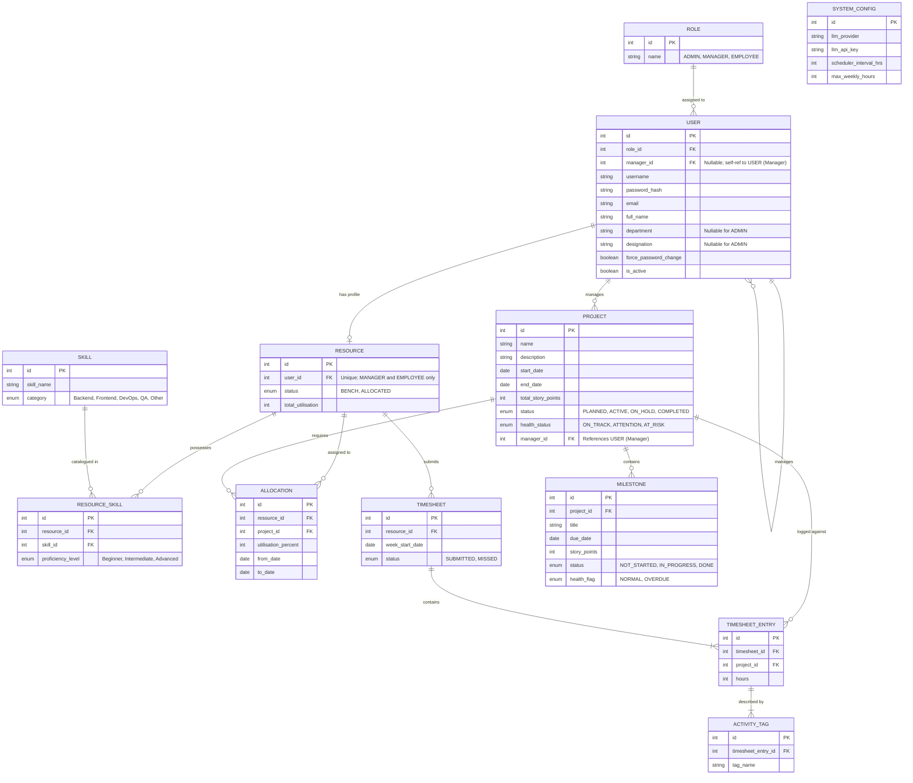

# PRM Tool — Entity-Relationship (ER) Diagram

Based on the BRD V4 requirements, the following ER diagram models the underlying database schema necessary to support the application.

### Key Design Notes:

1. **User vs. Resource Separation:** The `USER` table holds authentication, identity (`full_name`, `email`), organisational placement (`department`, `designation`, `manager_id`), and role assignment. The `RESOURCE` table holds workforce-specific state only — allocation status and utilisation. Admin users exist in `USER` but do not need a `RESOURCE` record. When Admin creates a MANAGER or EMPLOYEE account (Screen 3.4.1), the server auto-creates a linked `RESOURCE` profile; Admin then updates department/designation and assigns a manager on the `USER` record (Screens 3.1.4 / 3.1 update flows).

2. **Normalised Role Lookup:** Roles are stored in a dedicated `ROLE` table rather than an inline enum on `USER`. Each user has exactly one `role_id` FK, supporting consistent role naming across the application and easier extension if new roles are added later.

3. **Manager–Team Relationship:** `USER.manager_id` is a self-referencing FK to another `USER` (with MANAGER role). This enables manager-scoped visibility on the Resource Dashboard and Allocate Resource screens — managers only see resources whose linked user reports to them.

4. **Skill Catalogue vs. Resource Proficiency:** `SKILL` is the master catalogue of skill names and categories (used for grouping in the Resource Dashboard skill summary). `RESOURCE_SKILL` is the junction table linking a resource to a skill with a proficiency level. Admin adds skills to the catalogue when needed, then assigns them to resources via `RESOURCE_SKILL` (Screen 3.1.3).

5. **No Redundant Identity Fields on Resource:** Fields removed from the old `EMPLOYEE` table — `name`, `email`, `is_active`, `manager_id`, `department`, `designation` — are either owned by `USER` or derived from allocation state. `is_active` deactivation is handled at the `USER` level; the linked `RESOURCE` row remains for historical allocation and timesheet data.

6. **Story Points:** `PROJECT.total_story_points` and `MILESTONE.story_points` track progress (Screens 3.2.2, 3.2.4). `PROJECT.status` includes `COMPLETED` (Screen 3.2.3).

7. **AI Input Data Source:** The LLM's answers are fuelled by joining `USER` (name, department), `RESOURCE`, `RESOURCE_SKILL` → `SKILL`, `ALLOCATION` (free capacity), and `ACTIVITY_TAG` (recent practical skill evidence) via `TIMESHEET_ENTRY`.

8. **System Settings:** A single-row `SYSTEM_CONFIG` table stores dynamic application settings like the LLM key and the scheduler execution interval.

### Changes from Previous ER (V4 initial) → Normalised V4:

| Area | Before | After |
|------|--------|-------|
| Workforce entity | `EMPLOYEE` | `RESOURCE` (workforce state only) |
| Role storage | `enum role` on `USER` | `ROLE` lookup table + `USER.role_id` FK |
| HR / org fields | On `EMPLOYEE` | On `USER` (`department`, `designation`, `manager_id`) |
| Redundant fields | `name`, `email`, `is_active` duplicated | Removed from `RESOURCE`; sourced from `USER` |
| Skills | `EMPLOYEE_SKILL` (name embedded) | `SKILL` (catalogue) + `RESOURCE_SKILL` (junction) |
| FK renames | `employee_id` on allocations/timesheets | `resource_id` |
