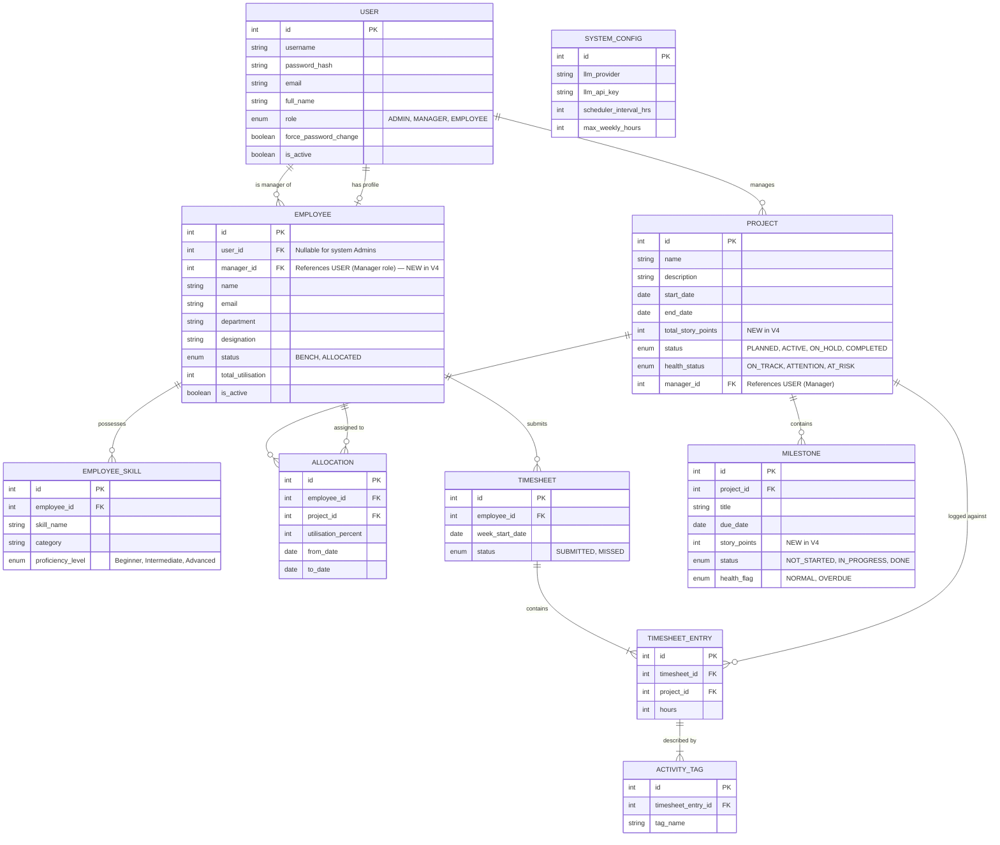

# PRM Tool — Entity-Relationship (ER) Diagram

Based on the BRD V4 requirements, the following ER diagram models the underlying database schema necessary to support the application.

### Key Design Notes:
1. **User vs. Employee Separation:** The `USER` table handles login credentials and roles. The `EMPLOYEE` table handles HR/work profile data. In V4, Admin creates a User account (Screen 3.4.1) and the server auto-creates an employee profile for MANAGER and EMPLOYEE roles; Admin then updates the profile and assigns a manager (Screen 3.1.4). Admin users exist in `USER` but do not need an `EMPLOYEE` record.
2. **Manager-Employee Relationship (V4 NEW):** `EMPLOYEE` now has a `manager_id` FK referencing `USER`. This enables the manager-scoped visibility on the Resource Dashboard and Allocate Resource screens — managers only see employees under their own team.
3. **Story Points (V4 NEW):** `PROJECT` gains a `total_story_points` field, and `MILESTONE` gains a `story_points` field. These are displayed in Screen 3.2.2 (View All Projects) and Screen 3.2.4 (Manage Milestones) to track project progress.
4. **Project Status `COMPLETED` (V4 NEW):** The `PROJECT.status` enum now includes a `COMPLETED` value visible in Screen 3.2.3 (Update Project Details).
5. **AI Input Data Source:** The LLM's answers are fuelled by joining `EMPLOYEE`, `EMPLOYEE_SKILL`, `ALLOCATION` (to calculate free capacity), and `ACTIVITY_TAG` (for recent practical skill evidence) via the `TIMESHEET_ENTRY`.
6. **System Settings:** A single-row `SYSTEM_CONFIG` table stores dynamic application settings like the LLM key and the scheduler execution interval.

### Changes from V3 → V4:
- **EMPLOYEE**: Added `manager_id FK` (references `USER`) — required for manager-scoped team visibility.
- **PROJECT**: Added `total_story_points INT` field; added `COMPLETED` to the `status` enum.
- **MILESTONE**: Added `story_points INT` field.
- **USER → EMPLOYEE**: Added new "is manager of" relationship line to reflect the `manager_id` FK.
