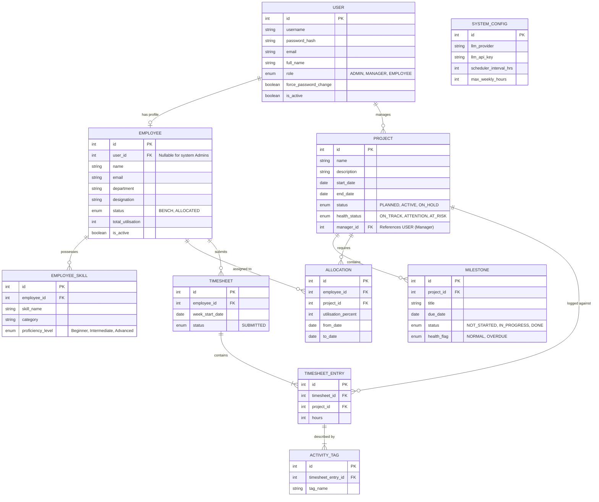

# PRM Tool — Entity-Relationship (ER) Diagram

Based on the BRD requirements, the following ER diagram models the underlying database schema necessary to support the application.

### Key Design Notes:
1. **User vs. Employee Separation:** The `USER` table handles login credentials and roles. The `EMPLOYEE` table handles HR/work profile data. The Admin adds a User account first, then links an Employee profile to it. Admin users themselves exist in `USER` but do not need an `EMPLOYEE` record.
2. **AI Input Data Source:** The LLM's answers are fueled by joining `EMPLOYEE`, `EMPLOYEE_SKILL`, `ALLOCATION` (to calculate free capacity), and `ACTIVITY_TAG` (for recent practical skill evidence) via the `TIMESHEET_ENTRY`.
3. **System Settings:** A single-row `SYSTEM_CONFIG` table stores dynamic application settings like the LLM key and the scheduler execution interval.
