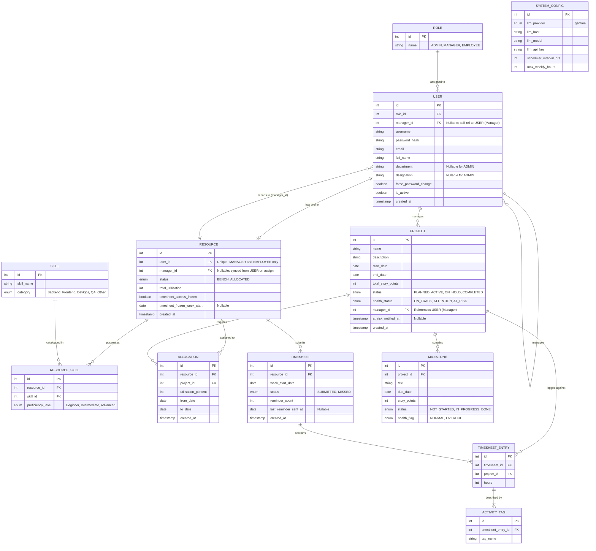

# PRM Tool — Entity-Relationship (ER) Diagram

Based on the BRD V4 requirements and the implemented MySQL schema, the following ER diagram models the underlying database structure.

### Key Design Notes:

1. **User vs. Resource Separation:** The `USER` table holds authentication, identity (`full_name`, `email`), organisational placement (`department`, `designation`, `manager_id`), and role assignment. The `RESOURCE` table holds workforce-specific state only — allocation status, utilisation, and timesheet-access controls. Admin users exist in `USER` but do not need a `RESOURCE` record. When Admin creates a MANAGER or EMPLOYEE account, the server auto-creates a linked `RESOURCE` profile.

2. **Manager–Team Relationship:** `USER.manager_id` and `RESOURCE.manager_id` both reference a MANAGER `USER`. On assign-manager, both columns are updated. Manager-scoped queries (`findByManagerId`) filter on `RESOURCE.manager_id`.

3. **Normalised Role Lookup:** Roles are stored in a dedicated `ROLE` table. Each user has exactly one `role_id` FK.

4. **Skill Catalogue vs. Resource Proficiency:** `SKILL` is the master catalogue. `RESOURCE_SKILL` is the junction table linking a resource to a skill with a proficiency level.

5. **Timesheet Compliance:** `TIMESHEET.reminder_count` and `last_reminder_sent_at` track email reminders. `RESOURCE.timesheet_access_frozen` blocks submission after repeated misses; managers restore access via the Restore Timesheet Access screen.

6. **Project Health Notifications:** `PROJECT.at_risk_notified_at` prevents duplicate AT_RISK alert emails until health recovers.

7. **Story Points:** `PROJECT.total_story_points` and `MILESTONE.story_points` feed scheduler health rules and manager project-detail views.

8. **AI Configuration:** `SYSTEM_CONFIG` stores `llm_host`, `llm_model`, and `llm_api_key` for the unified `GemmaAIService` (Ollama-compatible or cloud OpenAI-compatible endpoints such as Groq).

### Changes from prior ER → current schema:

| Area | Before | After |
|------|--------|-------|
| `RESOURCE` | utilisation fields only | Added `manager_id`, `timesheet_access_frozen`, `timesheet_frozen_week_start` |
| `TIMESHEET` | status only | Added `reminder_count`, `last_reminder_sent_at` |
| `PROJECT` | health status only | Added `at_risk_notified_at` |
| `SYSTEM_CONFIG` | provider + API key | Added `llm_host`, `llm_model`; provider enum is `gemma` only |
| `ALLOCATION` | no audit column | Added `created_at` |
