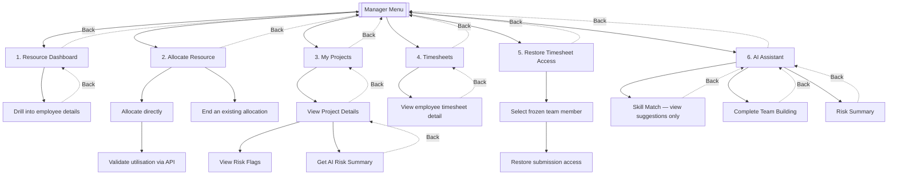
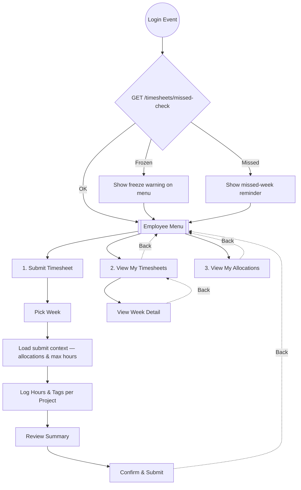
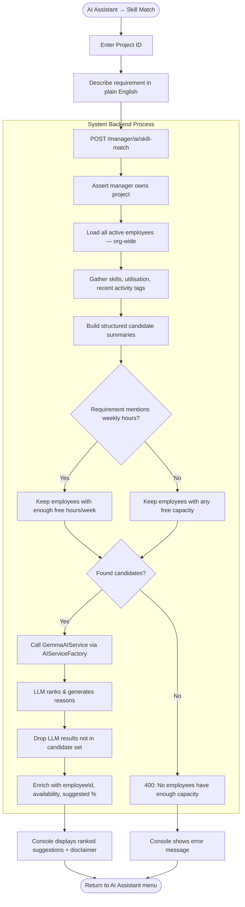
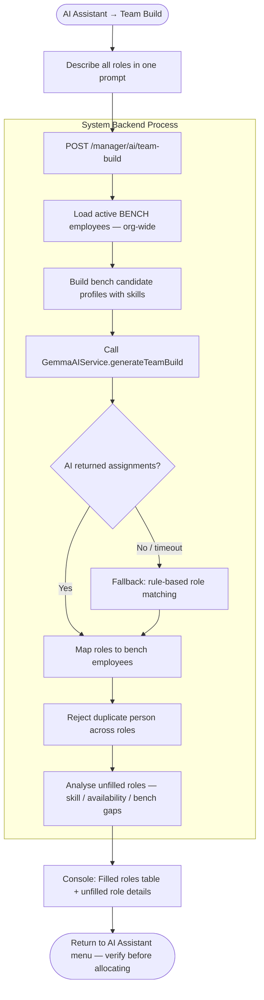
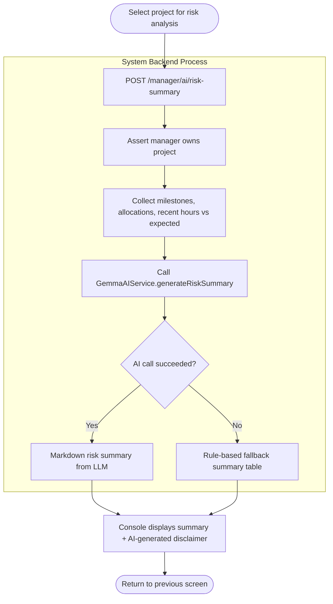
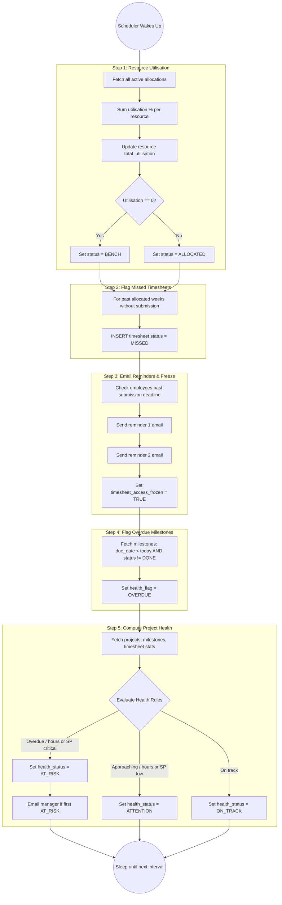

# PRM Tool — Flow Diagrams

These flowcharts illustrate the user navigation through the application screens as well as the logical steps of key system processes.

## 1. Overall Application Navigation & Authentication

---

## 2. Admin Menu Navigation

```mermaid
flowchart TD
    AdminMenu[[Admin Menu]]

    AdminMenu --> MngEmp[1. Manage Employees]
    MngEmp --> ViewEmp[View All Employees]
    MngEmp --> UpdateEmp[Update Employee]
    MngEmp --> DeactEmp[Deactivate Employee]
    MngEmp --> DeactPreview[Deactivate Preview — active allocations]
    DeactEmp --> DeactPreview
    MngEmp --> MngSkills[Manage Employee Skills]
    MngEmp --> AssignMgr[Assign Manager to Employee]
    MngEmp -. "Back" .-> AdminMenu

    AdminMenu --> MngProj[2. Manage Projects]
    MngProj --> CreateProj[Create Project]
    MngProj --> ViewProj[View All Projects]
    MngProj --> UpdateProj[Update Project Details]
    MngProj --> MngMiles[Manage Milestones]
    MngProj -. "Back" .-> AdminMenu

    AdminMenu --> ViewAlloc[3. View All Allocations]
    ViewAlloc -. "Back" .-> AdminMenu

    AdminMenu --> MngUsers[4. Manage Users]
    MngUsers --> CreateUser[Create User Account]
    MngUsers --> ViewUsers[View All Users]
    ViewUsers --> Reactivate[Reactivate Inactive User]
    MngUsers --> ResetPwd[Reset User Password]
    MngUsers --> DeactUser[Deactivate User]
    MngUsers -. "Back" .-> AdminMenu

    AdminMenu --> SysConfig[5. System Configuration]
    SysConfig --> UpdHost[Update LLM Host]
    SysConfig --> UpdModel[Update LLM Model]
    SysConfig --> UpdKey[Update LLM API Key]
    SysConfig --> UpdInterv[Update Scheduler Interval]
    SysConfig --> UpdHours[Update Max Weekly Hours]
    SysConfig -. "Back" .-> AdminMenu
```

> **Note:** "Add Employee" is not a separate menu option — employees are created via Manage Users → Create User Account, then assigned a manager under Manage Employees.

---

## 3. Manager Menu Navigation

> **Scoping Rule:** Dashboard, direct allocation, timesheets, and restore-access use the manager's team (`RESOURCE.manager_id`). AI Skill Match searches **all active employees** organisation-wide (manager must own the selected project). AI Team Build searches organisation-wide **bench** employees only.

---

## 4. Employee Menu Navigation

> **Compliance:** If submission access is frozen (`timesheet_access_frozen`), Submit Timesheet is blocked server-side until the manager restores access.

---

## 5. Logical Flow: AI Skill Match

Entry point: **Manager Menu → AI Assistant → Skill Match**. Results are suggestions only; the manager allocates separately via **Allocate Resource** if they choose to proceed.

---

## 6. Logical Flow: AI Team Build

Entry point: **Manager Menu → AI Assistant → Complete Team Building**. No project selection — searches organisation-wide bench only.

---

## 7. Logical Flow: AI Risk Summary

Entry points: **My Projects → Project Details → [A] AI Risk Summary**, or **AI Assistant → Risk Summary**.

---

## 8. Logical Flow: Background Scheduler

### Changes from prior diagrams → current implementation:
- **Admin:** Deactivate preview step; reactivate user from View All Users; system config uses LLM host/model instead of provider swap.
- **Manager:** AI lives under AI Assistant (not Allocate Resource); Skill Match is org-wide and read-only; Team Build and Risk Summary have dedicated flows; direct allocation validates via API.
- **Employee:** Login checks missed status and freeze state; submit flow loads context from API first.
- **AI:** Skill Match filters by parsed weekly hours or free capacity before LLM; Team Build falls back to rule-based matching; Risk Summary falls back when LLM is unavailable.
- **Scheduler:** Six logical steps including missed flagging, email reminders, access freeze, and AT_RISK manager notifications.
