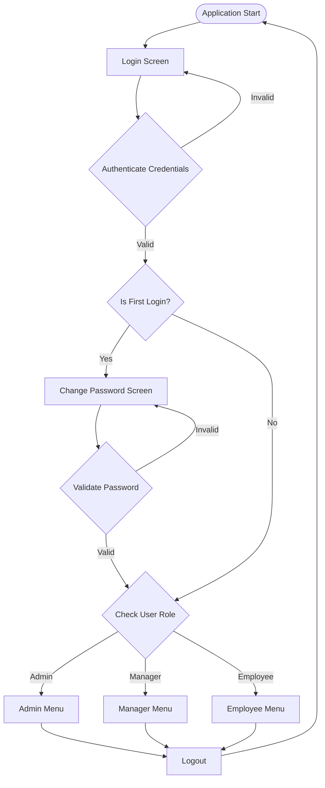
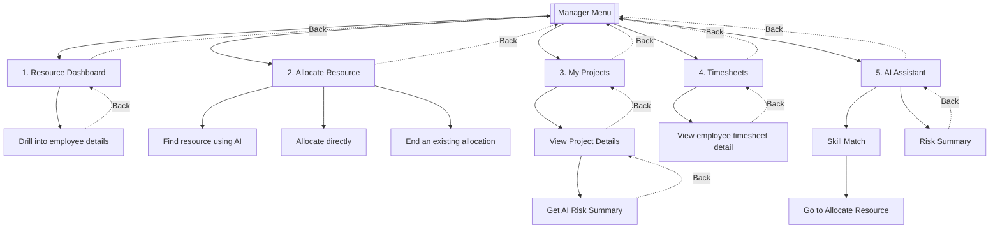
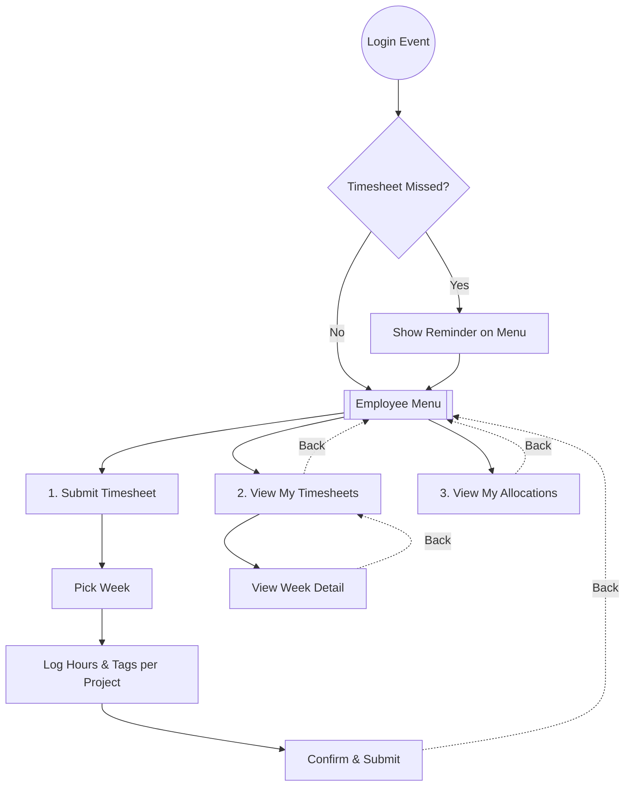
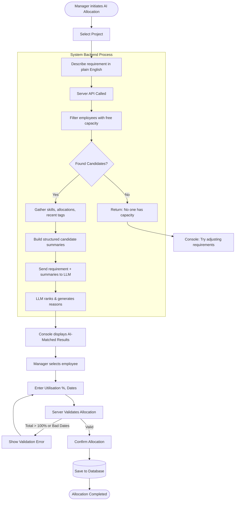
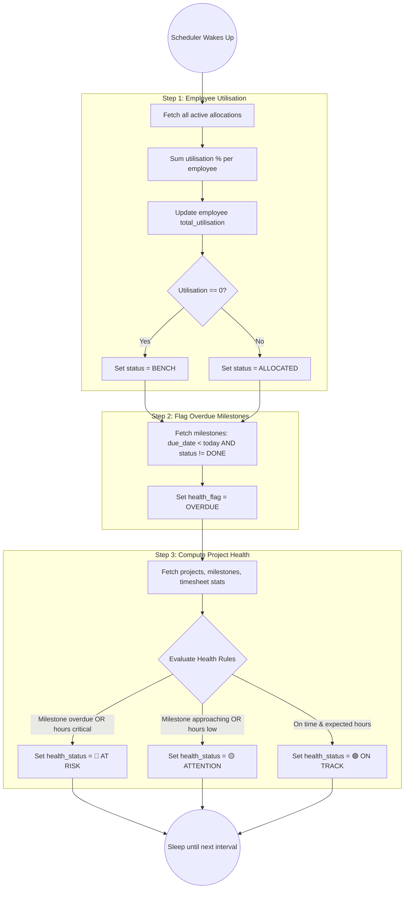

# PRM Tool — Flow Diagrams

These flowcharts illustrate the user navigation through the application screens as well as the logical steps of key system processes.

## 1. Overall Application Navigation & Authentication

---

## 2. Admin Menu Navigation

```mermaid
flowchart TD
    AdminMenu[[Admin Menu]]
    
    AdminMenu --> MngEmp[1. Manage Employees]
    MngEmp --> AddEmp[Add Employee]
    MngEmp --> ViewEmp[View All Employees]
    MngEmp --> UpdateEmp[Update Employee]
    MngEmp --> DeactEmp[Deactivate Employee]
    MngEmp --> MngSkills[Manage Employee Skills]
    MngEmp -. "Back" .-> AdminMenu
    
    AdminMenu --> MngProj[2. Manage Projects]
    MngProj --> CreateProj[Create Project]
    MngProj --> ViewProj[View All Projects]
    MngProj --> UpdateProj[Update Project Details]
    MngProj --> MngMiles[Manage Milestones]
    MngProj -. "Back" .-> AdminMenu
    
    AdminMenu --> ViewAlloc[3. View All Allocations]
    ViewAlloc -. "Back" .-> AdminMenu
    
    AdminMenu --> MngUsers[4. Manage Users]
    MngUsers --> CreateUser[Create User Account]
    MngUsers --> ViewUsers[View All Users]
    MngUsers --> ResetPwd[Reset User Password]
    MngUsers --> DeactUser[Deactivate User]
    MngUsers -. "Back" .-> AdminMenu
    
    AdminMenu --> SysConfig[5. System Configuration]
    SysConfig --> UpdKey[Update LLM API Key]
    SysConfig --> UpdProv[Change LLM Provider]
    SysConfig --> UpdInterv[Update Scheduler Interval]
    SysConfig --> UpdHours[Update Max Weekly Hours]
    SysConfig -. "Back" .-> AdminMenu
```

---

## 3. Manager Menu Navigation

---

## 4. Employee Menu Navigation

---

## 5. Logical Flow: AI-Assisted Resource Allocation

---

## 6. Logical Flow: Background Scheduler

