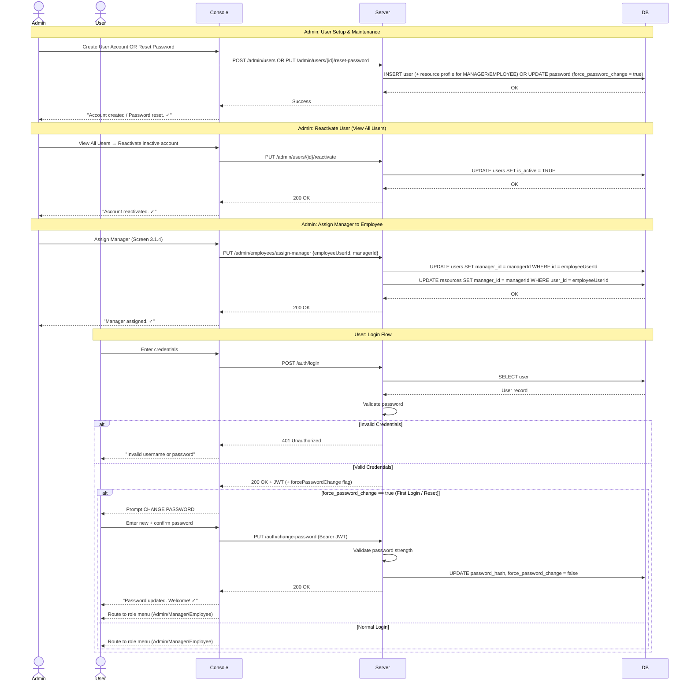
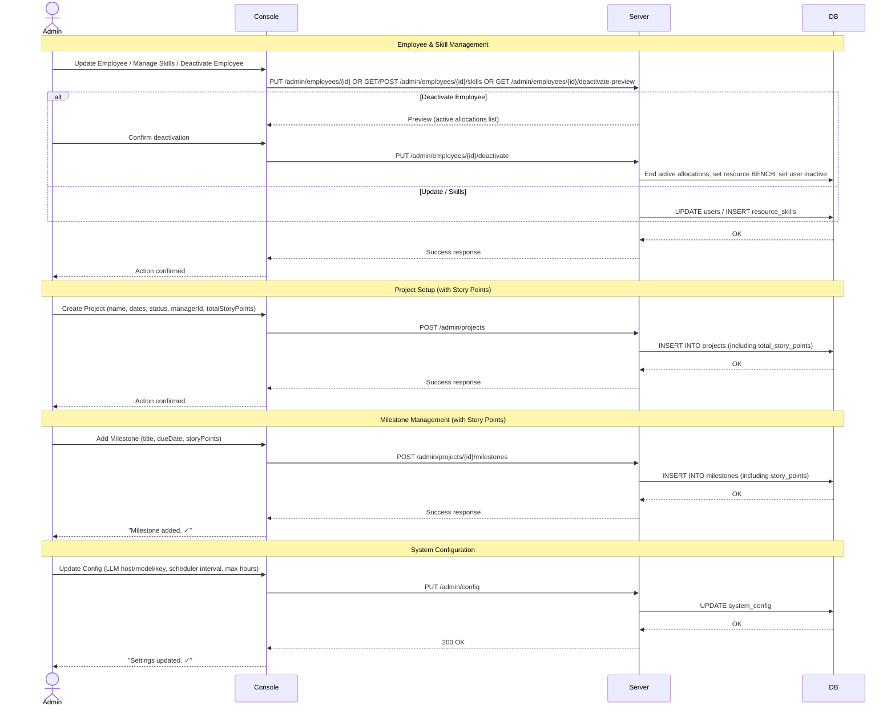
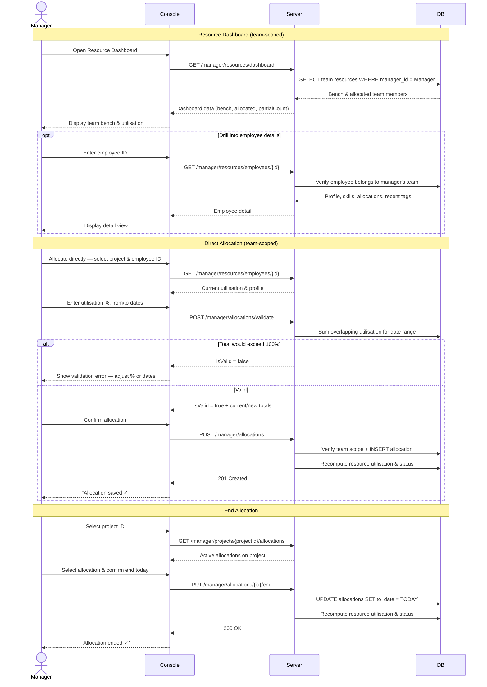
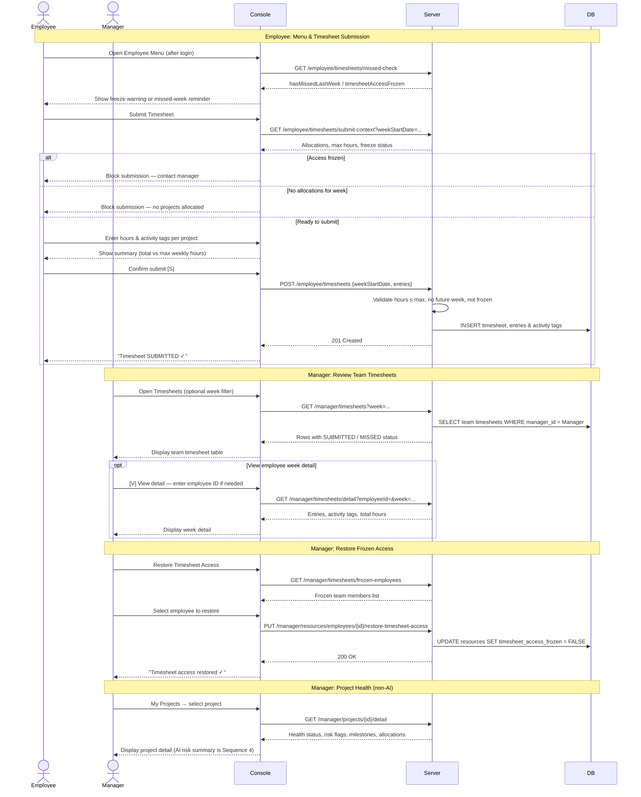

# PRM Tool — Consolidated Sequence Diagrams

These 6 comprehensive, role-based workflows show how the system operates end-to-end.

---

## 1. Authentication & User Management
Covers Admin creating/resetting/reactivating users, assigning managers, and the User login flow (including the forced password change on first login).



---

## 2. Core Admin Setup
Covers administrative tasks: managing employees (with deactivate preview), skills, projects (with story points), and system configuration.



---

## 3. Manager Dashboard & Resource Allocation
Covers the team-scoped dashboard, direct allocation (with validation), and ending allocations. AI features are in Sequence 4.



---

## 4. Manager AI Assistant
Covers Skill Match, Team Build, and Risk Summary. All three are read-only suggestions — the manager allocates separately via Sequence 3.

```mermaid
sequenceDiagram
    actor Manager
    participant Console
    participant Server
    participant DB
    participant LLM

    Note over Manager,LLM: Skill Match — org-wide candidates (manager must own project)
    Manager->>Console: AI Assistant → Skill Match
    Manager->>Console: Enter project ID + requirement
    Console->>Server: POST /manager/ai/skill-match {projectId, requirement}
    Server->>DB: Assert manager owns project
    Server->>DB: Load all active employees (org-wide)
    Server->>DB: Gather skills, utilisation, recent activity tags
    Server->>Server: Parse weekly hours from requirement (if present)
    Server->>Server: Filter candidates by free capacity
    alt No candidates with enough capacity
        Server-->>Console: 400 Bad Request
        Console-->>Manager: Show error — adjust requirement
    else Candidates found
        Server->>LLM: generateSkillMatch (GemmaAIService)
        LLM-->>Server: Ranked names + plain-English reasons
        Server->>Server: Drop invalid names; enrich with employeeId & availability
        Server-->>Console: Enriched match results
        Console-->>Manager: Display suggestions + verify-before-allocate note
    end

    Note over Manager,LLM: Team Build — org-wide bench only
    Manager->>Console: AI Assistant → Complete Team Building
    Manager->>Console: Describe all roles in one prompt
    Console->>Server: POST /manager/ai/team-build {requirement}
    Server->>DB: Load active BENCH employees (org-wide)
    Server->>DB: Build bench profiles with skills
    Server->>LLM: generateTeamBuild (with timeout)
    alt AI returns assignments
        LLM-->>Server: Role → employee mappings
    else AI fails or times out
        Server->>Server: Fallback — rule-based role matching
    end
    Server->>Server: Deduplicate people across roles; analyse unfilled gaps
    Server-->>Console: filled + unfilled roles (skill / availability / bench gaps)
    Console-->>Manager: Display team build results + disclaimer

    Note over Manager,LLM: Risk Summary — My Projects or AI Assistant
    Manager->>Console: Select project (from My Projects or AI Assistant)
    Console->>Server: POST /manager/ai/risk-summary {projectId}
    Server->>DB: Assert manager owns project
    Server->>DB: Gather milestones, allocations, recent hours vs expected
    Server->>LLM: generateRiskSummary
    alt LLM call succeeds
        LLM-->>Server: Markdown risk summary
    else LLM unavailable
        Server->>Server: Build rule-based fallback summary table
    end
    Server-->>Console: { summary }
    Console-->>Manager: Display risk summary + AI-generated disclaimer
```

---

## 5. Timesheets, Compliance & Project Health
Covers employees submitting timesheets (with freeze checks), managers reviewing them, and restoring frozen access.



---

## 6. Background Scheduler
The automated backend process that keeps system state accurate and sends notifications.

```mermaid
sequenceDiagram
    participant Scheduler
    participant DB
    participant Email

    loop Every N hours (configurable via system_config)
        Scheduler->>Scheduler: Wake up (node-cron worker thread)

        Note over Scheduler,DB: Step 1: Resource Utilisation
        Scheduler->>DB: SELECT all active resources
        Scheduler->>Scheduler: Sum today's overlapping utilisation % per resource
        Scheduler->>DB: UPDATE total_utilisation; set status BENCH or ALLOCATED

        Note over Scheduler,DB: Step 2: Flag Missed Timesheets
        Scheduler->>DB: For past allocated weeks without submission, INSERT status = MISSED

        Note over Scheduler,Email: Step 3: Timesheet Email Reminders & Freeze
        Scheduler->>Scheduler: On working days only — compare today to deadline calendar
        Scheduler->>DB: Find allocated employees with unsubmitted last-week timesheet
        alt Today = 1st working day after deadline
            Scheduler->>Email: Send reminder 1 to employee
            Scheduler->>DB: UPDATE reminder_count = 1 on timesheet
        else Today = 2nd working day after deadline
            Scheduler->>Email: Send reminder 2 to employee
            Scheduler->>DB: UPDATE reminder_count = 2 on timesheet
        else Today = 3rd working day after deadline
            Scheduler->>DB: SET timesheet_access_frozen = TRUE on resource
            Scheduler->>Email: Notify employee + manager of freeze
        end

        Note over Scheduler,DB: Step 4: Flag Overdue Milestones
        Scheduler->>DB: SELECT milestones WHERE due_date < today AND status != DONE
        Scheduler->>DB: UPDATE milestone SET health_flag = OVERDUE

        Note over Scheduler,Email: Step 5: Compute Project Health & Notify
        Scheduler->>DB: SELECT projects, milestones, last-week timesheet stats
        Scheduler->>Scheduler: Apply health rules (overdue milestones, hours, story points)
        alt Milestone overdue OR hours/SP critical
            Scheduler->>DB: UPDATE health_status = AT_RISK
            opt First AT_RISK transition (at_risk_notified_at is null)
                Scheduler->>Email: Send project health alert to manager
                Scheduler->>DB: SET at_risk_notified_at
            end
        else Milestone approaching OR hours/SP low
            Scheduler->>DB: UPDATE health_status = ATTENTION
        else On time & expected progress
            Scheduler->>DB: UPDATE health_status = ON_TRACK
            Scheduler->>DB: CLEAR at_risk_notified_at if health recovered
        end

        Scheduler->>Scheduler: Sleep until next interval
    end
```

### Changes from prior diagrams → current implementation:
- **Sequence 1:** JWT is always issued on valid login; change-password uses Bearer token.
- **Sequence 2:** Skills management uses GET/POST on `/admin/employees/{id}/skills`; deactivate uses preview then confirm.
- **Sequence 3:** Dashboard, direct allocation, and end allocation only — team-scoped; validate before POST.
- **Sequence 4:** New — AI Skill Match (org-wide), Team Build (bench + fallback), Risk Summary (with LLM fallback); no allocation step.
- **Sequence 5:** Employee missed-check on menu load; submit-context freeze guard; manager timesheet detail endpoint; scheduler removed from this diagram.
- **Sequence 6:** Reminder/freeze tied to working days after deadline; clears `at_risk_notified_at` when health recovers.
