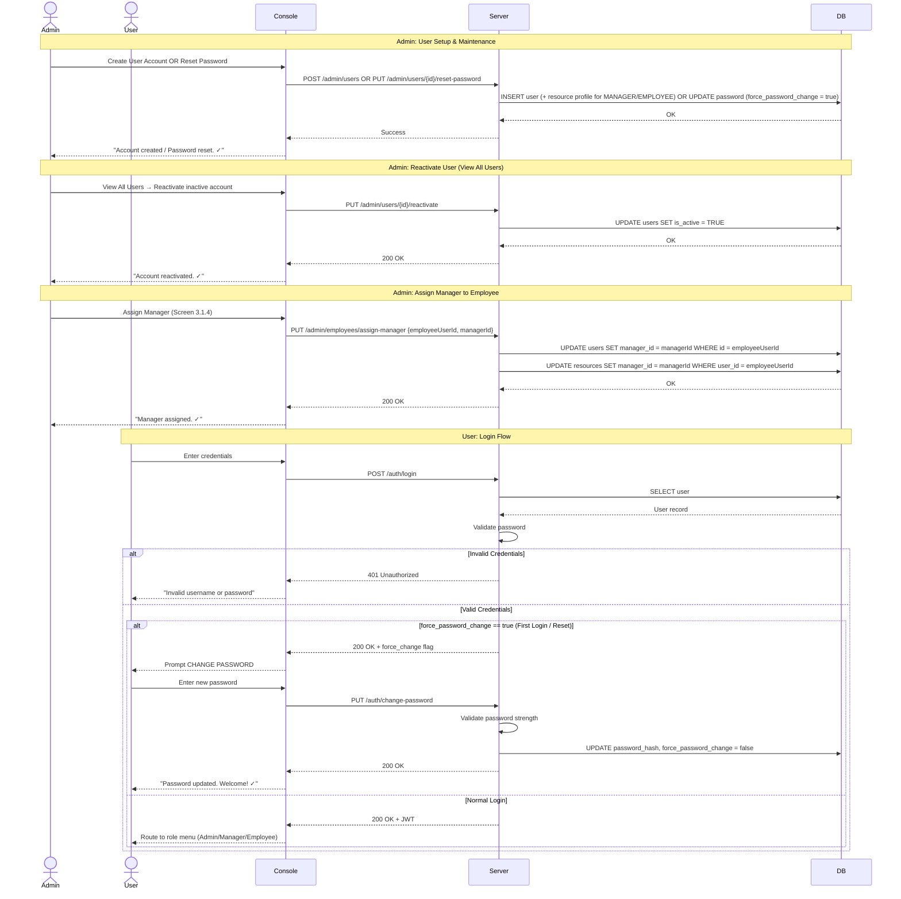
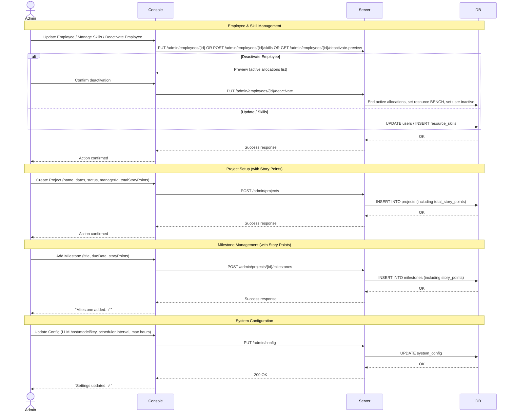
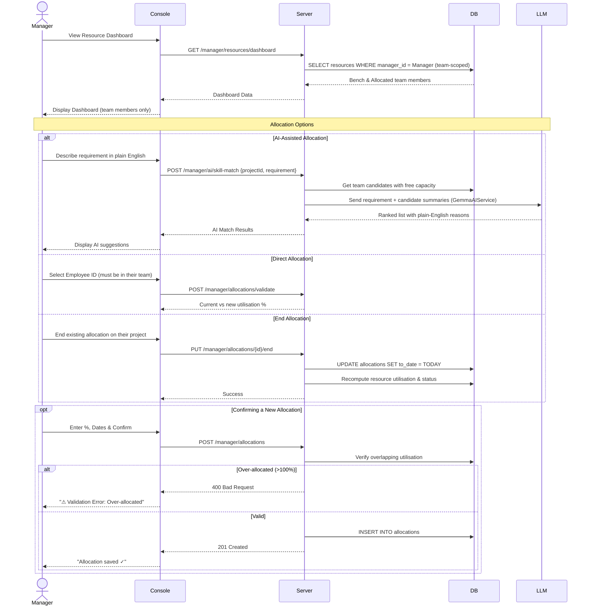
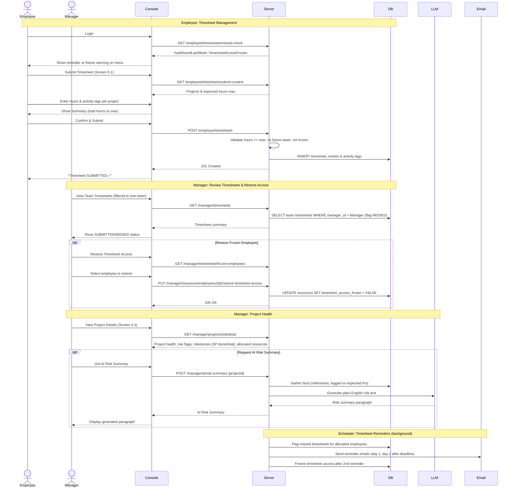

# PRM Tool — Consolidated Sequence Diagrams

These 5 comprehensive, role-based workflows show how the system operates end-to-end.

---

## 1. Authentication & User Management
Covers Admin creating/resetting/reactivating users, assigning managers, and the User login flow (including the forced password change on first login).



---

## 2. Core Admin Setup
Covers administrative tasks: managing employees (with deactivate preview), skills, projects (with story points), and system configuration.



---

## 3. Manager Resource Allocation (incl. AI)
Covers viewing the team-scoped dashboard, finding resources (via AI or direct), validating utilisation, and executing the allocation.



---

## 4. Timesheets, Compliance & Project Health
Covers employees submitting timesheets (with freeze checks), managers reviewing them, restoring frozen access, and AI project health analysis.



---

## 5. Background Scheduler
The automated backend process that keeps system state accurate and sends notifications.

```mermaid
sequenceDiagram
    participant Scheduler
    participant DB
    participant Email

    loop Every N hours (Configurable)
        Scheduler->>Scheduler: Wake up (node-cron)

        Note over Scheduler,DB: Step 1: Resource Utilisation
        Scheduler->>DB: SELECT active allocations
        Scheduler->>Scheduler: Sum overlapping utilisation % per resource
        Scheduler->>DB: UPDATE total_utilisation, set status (BENCH / ALLOCATED)

        Note over Scheduler,DB: Step 2: Flag Missed Timesheets
        Scheduler->>DB: For past weeks with allocation but no submission, INSERT status = MISSED

        Note over Scheduler,Email: Step 3: Timesheet Email Reminders
        Scheduler->>DB: Find employees past deadline without submission
        Scheduler->>Email: Send reminder 1 / reminder 2
        Scheduler->>DB: Increment reminder_count; freeze access after 2nd reminder

        Note over Scheduler,DB: Step 4: Flag Overdue Milestones
        Scheduler->>DB: SELECT milestones WHERE due_date < today AND status != DONE
        Scheduler->>DB: UPDATE milestone SET health_flag = OVERDUE

        Note over Scheduler,Email: Step 5: Compute Project Health & Notify
        Scheduler->>DB: SELECT projects, milestones (SP done vs total), timesheet stats
        Scheduler->>Scheduler: Apply Health Rules (hours + story points + milestones)
        alt Milestone overdue OR hours/SP critical
            Scheduler->>DB: UPDATE health_status = AT_RISK
            opt First AT_RISK transition
                Scheduler->>Email: Send project health alert to manager
                Scheduler->>DB: SET at_risk_notified_at
            end
        else Milestone approaching OR hours/SP low
            Scheduler->>DB: UPDATE health_status = ATTENTION
        else On time & expected progress
            Scheduler->>DB: UPDATE health_status = ON_TRACK
        end

        Scheduler->>Scheduler: Sleep until next interval
    end
```

### Changes from prior diagrams → current implementation:
- **Sequence 1:** Added reactivate-user flow; assign-manager now updates both `users` and `resources`.
- **Sequence 2:** Deactivate employee uses deactivate-preview; skills route is `/admin/employees/{id}/skills`; system config includes `llm_host` and `llm_model`.
- **Sequence 3:** Utilisation check uses `POST /manager/allocations/validate`; AI calls go through `GemmaAIService`.
- **Sequence 4:** Added missed-check and submit-context endpoints; timesheet freeze and manager restore-access flow; scheduler reminder emails.
- **Sequence 5:** Expanded to five steps: utilisation, missed flagging, email reminders/freeze, overdue milestones, health computation with AT_RISK email notifications.
