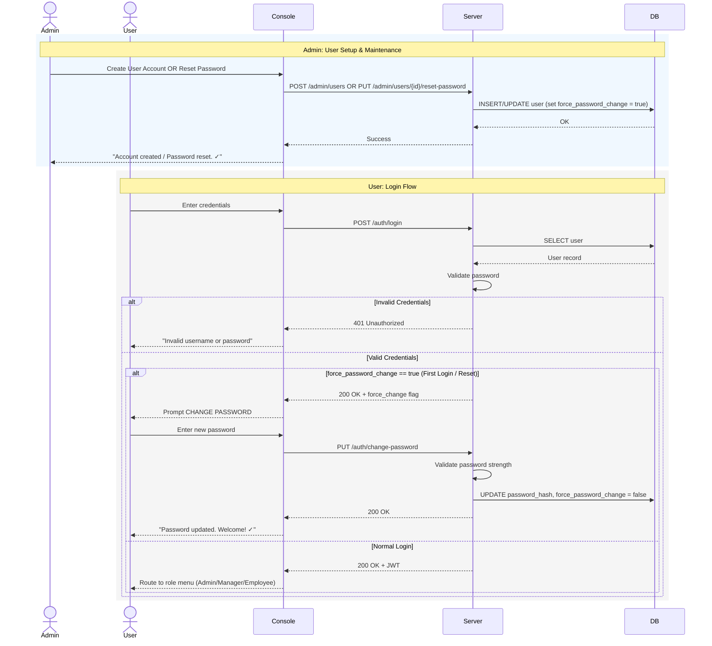
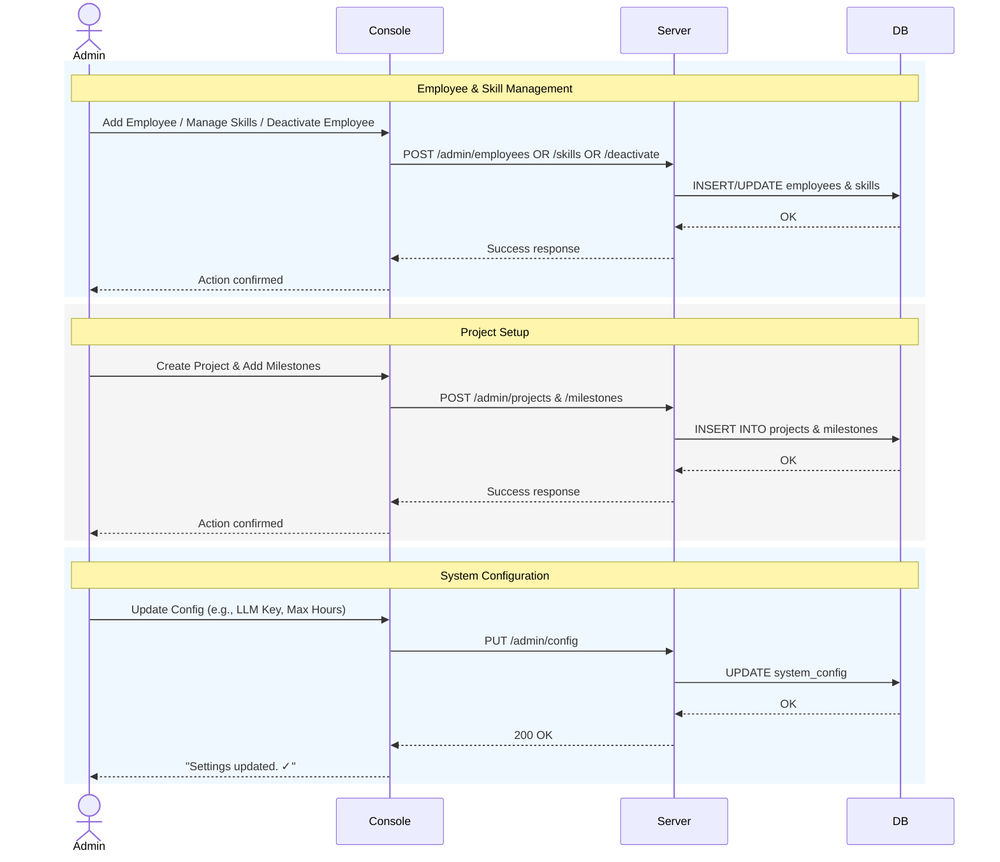
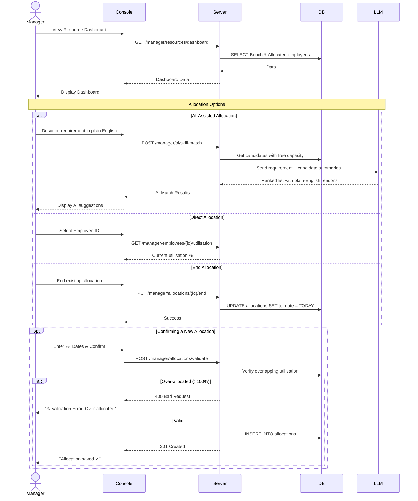
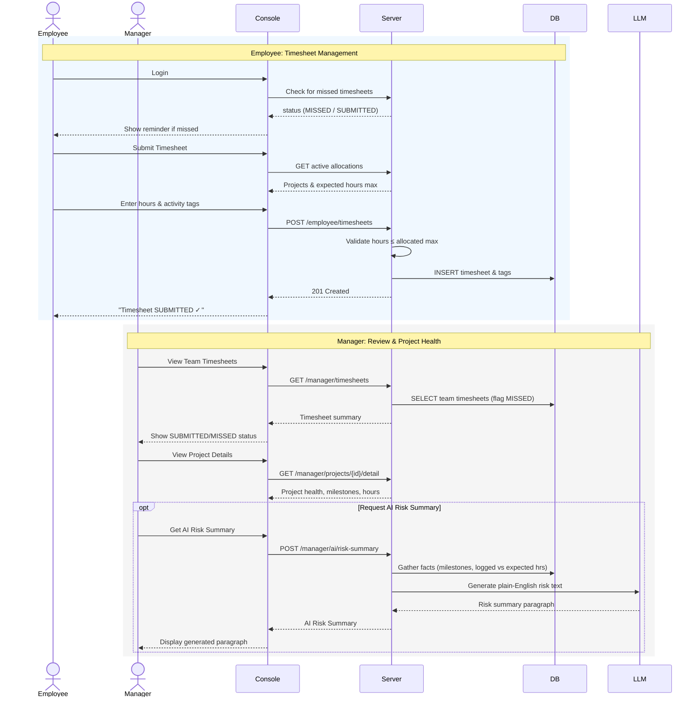
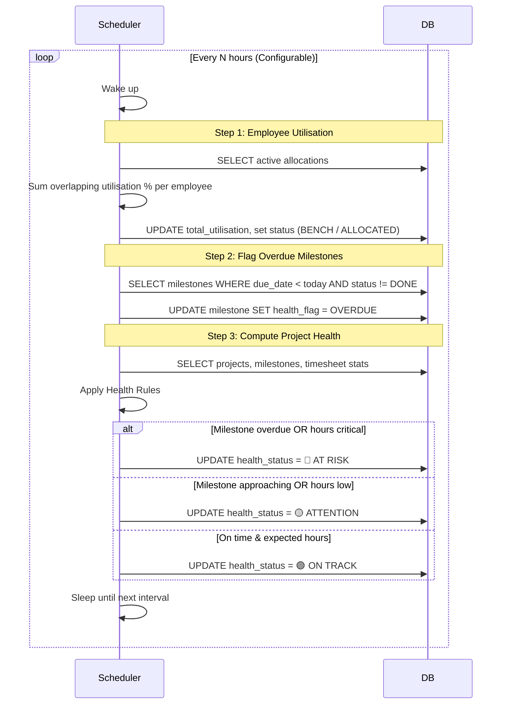

# PRM Tool — Consolidated Sequence Diagrams

I have merged the 21 individual sequence diagrams into **5 comprehensive, role-based workflows**. This provides a clearer view of how the system operates end-to-end.

---

## 1. Authentication & User Management
Covers Admin creating/resetting users, and the User login flow (including the forced password change on first login).

---

## 2. Core Admin Setup
Covers all standard administrative tasks: managing employees, skills, projects, and system configuration.

---

## 3. Manager Resource Allocation (incl. AI)
Covers viewing the dashboard, finding resources (via AI or direct), and executing the allocation.

---

## 4. Timesheets & Project Health
Covers employees submitting timesheets and managers reviewing them alongside project health metrics via AI.

---

## 5. Background Scheduler
The automated backend process that keeps the system state accurate without user intervention.

