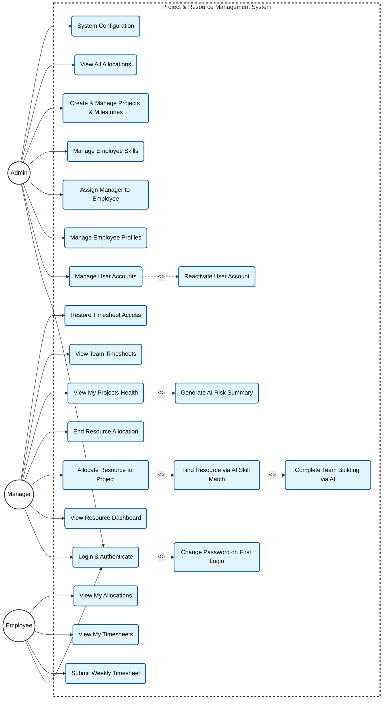

# PRM Tool — Use Case Diagram

The following diagram maps out the primary actors (Admin, Manager, and Employee) and the specific use cases they interact with inside the system boundary. It uses standard `<<includes>>` and `<<extends>>` terminology where applicable.

### Explanation of Use Case Relationships:

1. **`<<includes>>`**: The `Login & Authenticate` use case _includes_ `Change Password on First Login` because the system enforces this flow automatically if the `force_password_change` flag is true.
2. **`<<extends>>`**: `Find Resource via AI Skill Match` _extends_ the `Allocate Resource` use case, meaning it is an optional AI-driven path the manager can take to accomplish allocation.
3. **`<<extends>>`**: `Generate AI Risk Summary` _extends_ the `View My Projects Health` use case, as it is an optional analytical tool triggered while viewing project details.
4. **`<<extends>>`**: `Reactivate User Account` _extends_ `Manage User Accounts` — available from View All Users for inactive accounts.
5. **`<<extends>>`**: `Complete Team Building via AI` _extends_ AI skill matching — available from the AI Assistant menu (`POST /manager/ai/team-build`).
6. **`Restore Timesheet Access`**: Manager unfreezes an employee whose timesheet submission was blocked after missed deadlines and reminders.

### Changes from prior diagram → current implementation:
- **Added** `UC_Reactivate`, `UC_ViewAlloc`, `UC_RestoreTS`, `UC_TeamBuild`.
- **Manager visibility:** Dashboard, allocation, and timesheet use cases remain scoped to the manager's team (`RESOURCE.manager_id`).
- **Terminology:** Domain entity is `Resource`; UI and API DTOs still refer to "employee" for workforce members.
