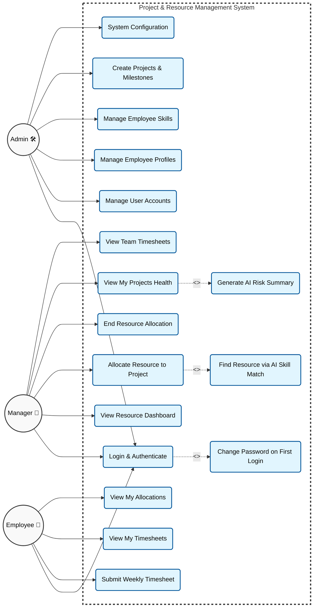

# PRM Tool — Use Case Diagram

The following diagram maps out the primary actors (Admin, Manager, and Employee) and the specific use cases they interact with inside the system boundary. It uses standard `<<includes>>` and `<<extends>>` terminology where applicable.

### Explanation of Use Case Relationships:

1. **`<<includes>>`**: The `Login & Authenticate` use case _includes_ `Change Password on First Login` because the system enforces this flow automatically if the `force_password_change` flag is true.
2. **`<<extends>>`**: `Find Resource via AI Skill Match` _extends_ the `Allocate Resource` use case, meaning it is an optional AI-driven path the manager can take to accomplish the goal of allocation.
3. **`<<extends>>`**: `Generate AI Risk Summary` _extends_ the `View My Projects Health` use case, as it is an optional analytical tool the manager can trigger while viewing project details.
